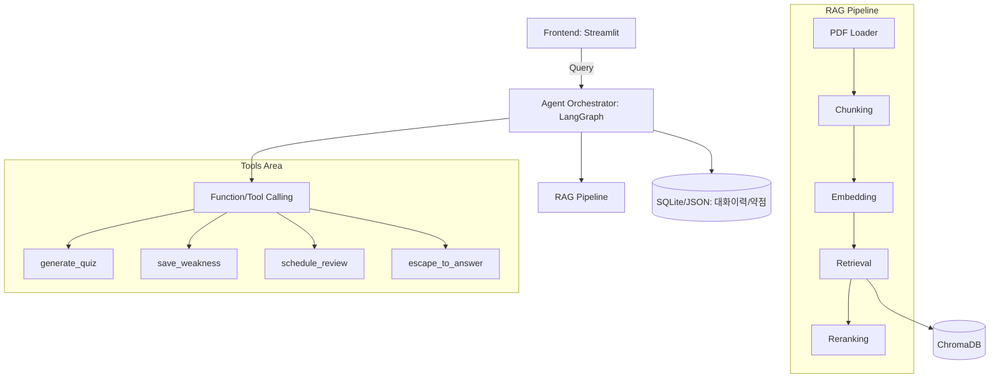
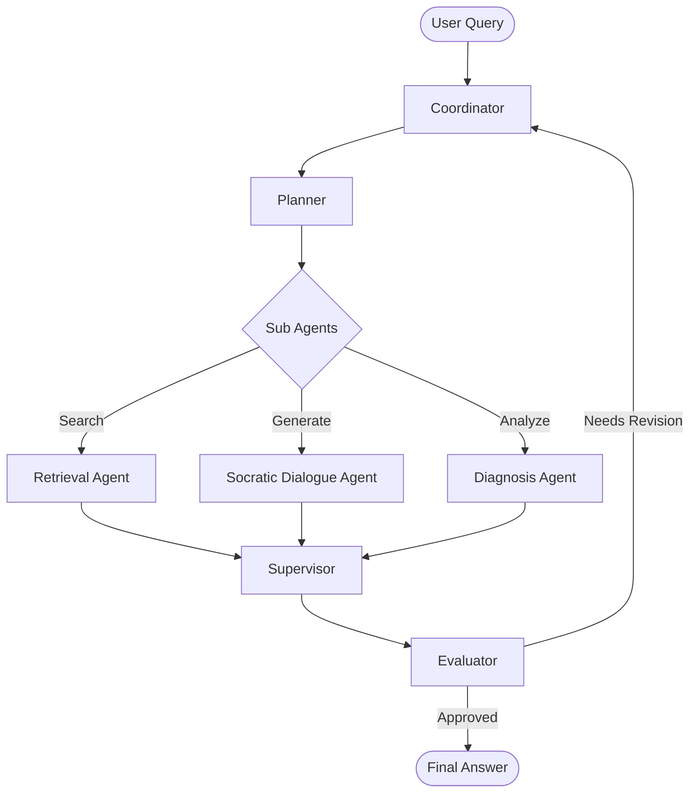

# System Design & Architecture - SocrAItes

## 1. 시스템 아키텍처 개요
SocrAItes 시스템은 Frontend, Agent Orchestrator, RAG Pipeline, 외부 Tools 계층으로 나뉘어 동작합니다.

### 1.1 하이레벨 아키텍처

## 2. Agent 계층 구조 (Agentic Flow)
시스템은 LangGraph를 기반으로 Core Agent와 Sub Agent로 역할을 분리하여 처리합니다.

### 2.1 Core Agent
- **Coordinator:** 첫 진입점. 단순 대화인지, 학습 질의인지 분석하여 라우팅.
- **Planner:** 세부 실행 계획 수립, Socratic Depth 설정, 적절한 Sub Agent 선택.
- **Supervisor:** Sub Agent들의 결과를 종합, 강의자료 근거 환각 검증, 최종 한국어 답변 초안 작성. 좌절 신호 감지 시 Scaffolding 적용.
- **Evaluator:** 초안 답변 품질(RAG 근거 일치여부, 반문 비율 등) 검증 및 피드백. (Self-Correction Loop)

### 2.2 Sub Agent
- **Retrieval Agent:** ChromaDB 연동 및 관련 강의자료 청크 검색.
- **Socratic Dialogue Agent:** LLM을 활용한 소크라테스식 발화(반문, 힌트) 생성.
- **Diagnosis Agent:** 대화 이력 분석을 통한 약점 도출 및 학습 도구 호출 관리.

### 2.3 Agent Workflow Diagram

## 3. 데이터 파이프라인 및 상태 관리
- **Vector DB (ChromaDB):** 강의자료 청크, 메타데이터 보관.
- **RDBMS/NoSQL (SQLite/JSON):** 사용자의 세션 정보, 턴별 대화 이력, 약점(Weakness) 데이터 보관.
- **State Management:** LangGraph의 StateGraph를 사용하여 `messages`, `socratic_depth`, `frustration_level`, `retrieved_docs` 등을 턴마다 관리.

## 4. 핵심 알고리즘: Adaptive Socratic Depth
사용자의 입력(Sentiment Analysis)과 대화의 진행 상태를 기반으로 반문 횟수와 힌트 레벨을 조절합니다.
1. **Frustration Detection:** "모르겠어", "답을 줘" 등 입력 시 `frustration_level` 증가.
2. **Scaffolding (점진적 힌트):** `frustration_level`이 임계치를 넘으면 질문의 난이도를 낮추고 배경지식 힌트를 제공.
3. **Escape to Answer:** 극단적 좌절 감지 시 `escape_to_answer` 툴을 호출하여 정답 모드로 즉각 전환.
